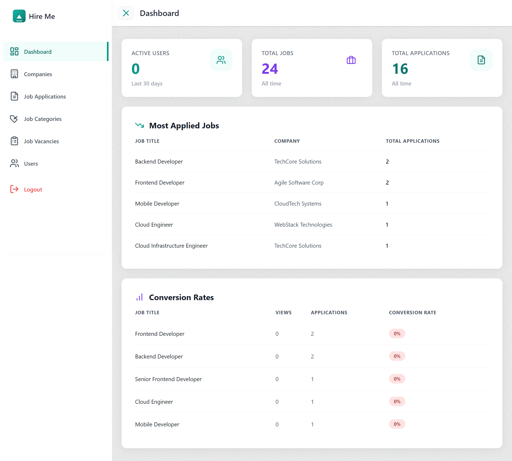
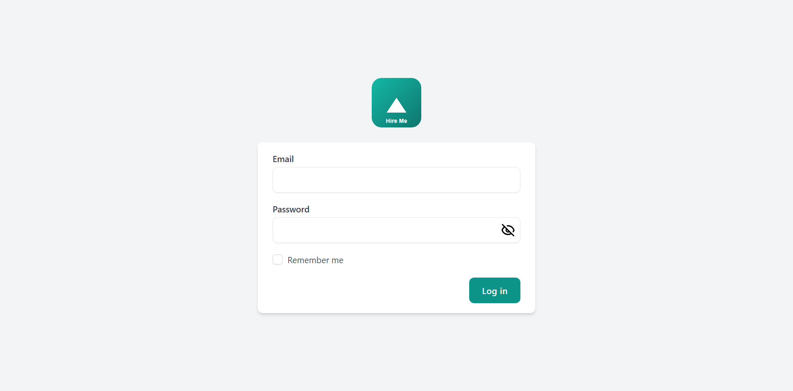
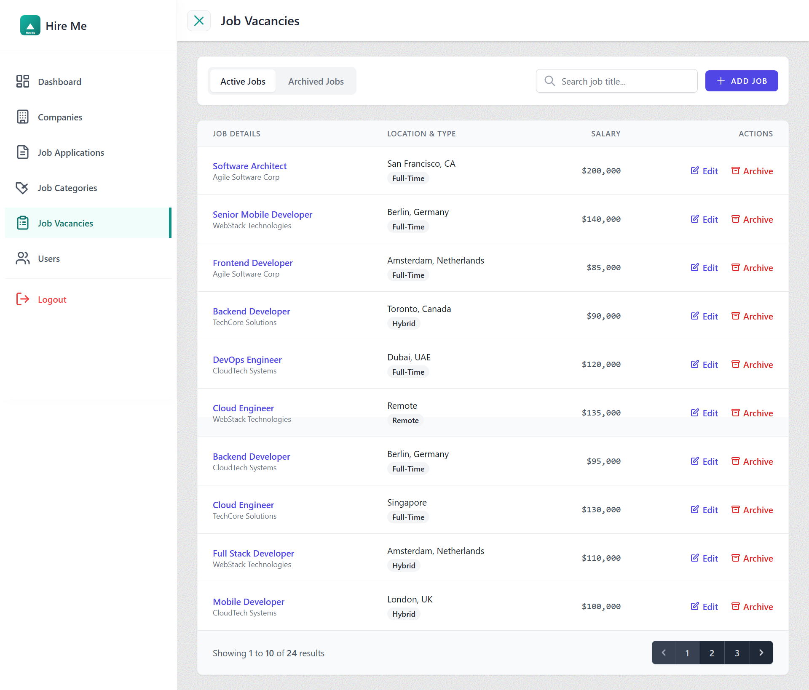
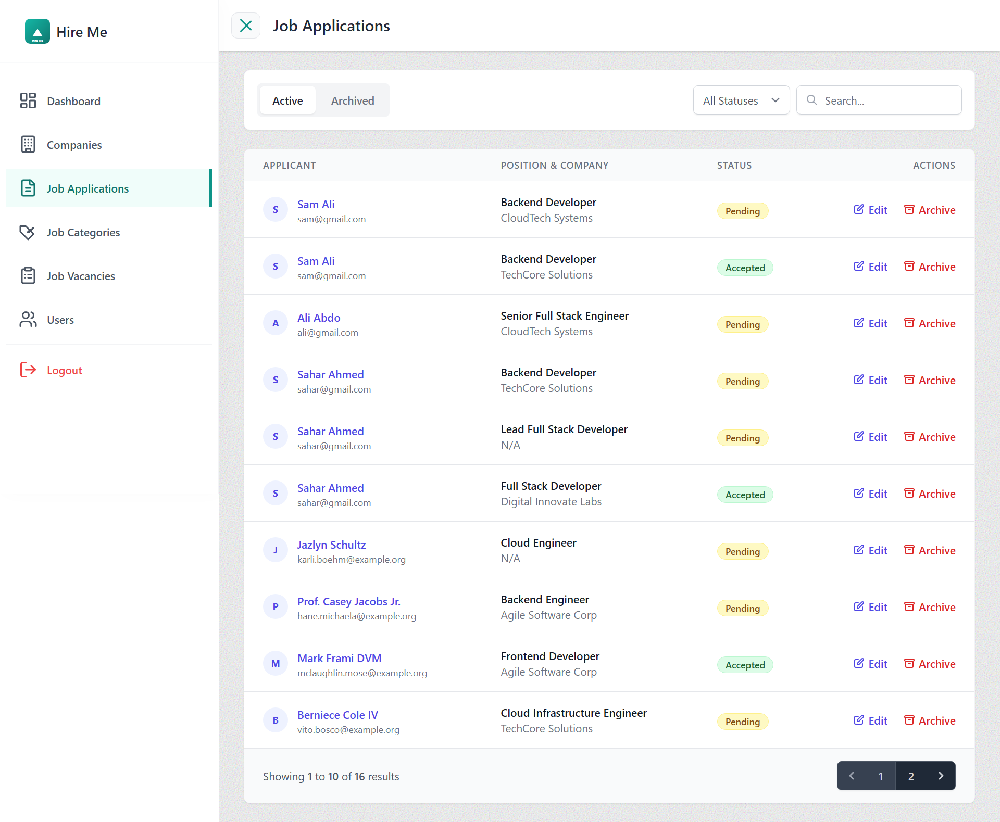
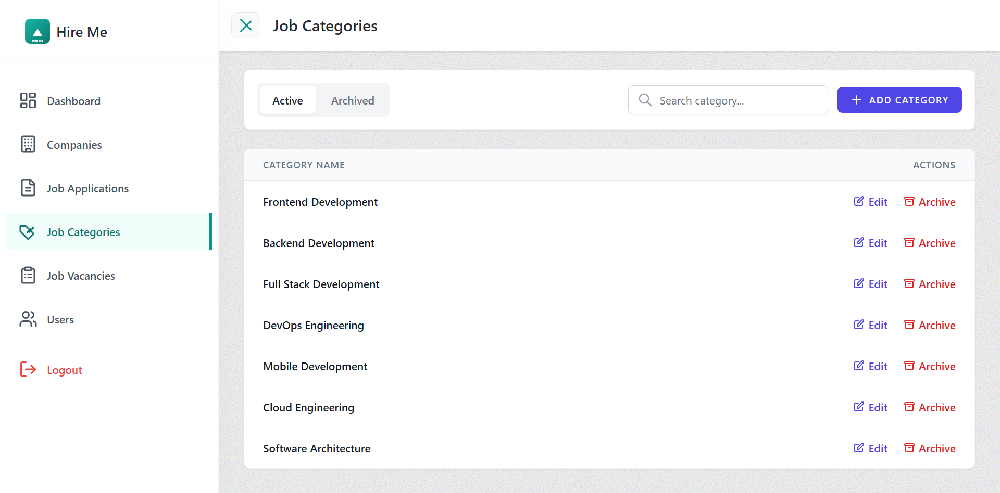
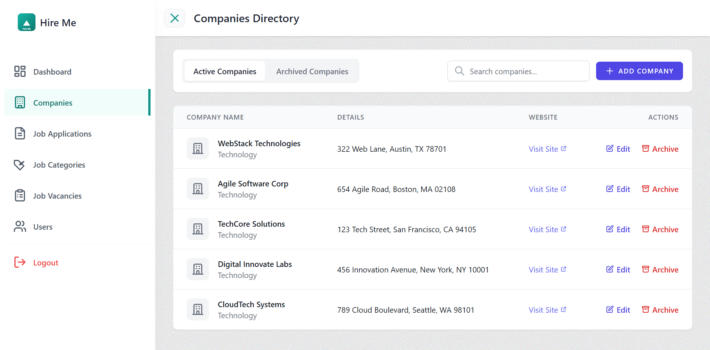
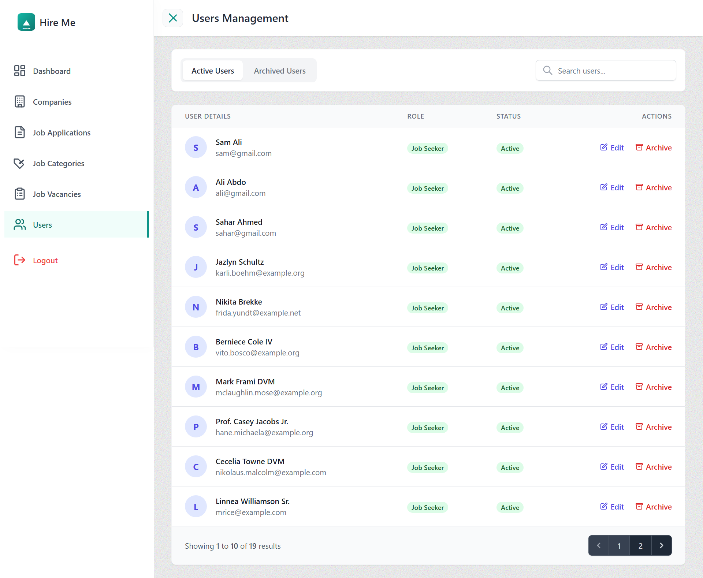

# Job Vacancies Platform (Job Backoffice)

<div align="center">



[](https://laravel.com)
[](https://php.net)
[](https://tailwindcss.com)
[](https://alpinejs.dev)

</div>


- [Live Demo](https://job-backoffice-tpr26.ondigitalocean.app/login)

---

## 📋 Table of Contents

- [Introduction](#-introduction)
- [Key Features](#-key-features)
- [Project Interfaces](#-project-interfaces)
- [Project Structure](#-project-structure)
- [System Requirements](#-system-requirements)
- [Installation & Setup](#-installation--setup)
- [Technologies Used](#-technologies-used)
- [Contribution](#-contribution)
- [Common Issues](#-common-issues)
- [Support](#-support)

---

## 🚀 Introduction

The **Job Application BackOffice Platform** is a powerful administrative dashboard designed to streamline the management of job vacancies, user applications, and company profiles. It serves as the centralized control center for the job recruitment ecosystem.

The system is built to provide:
- **Efficiency**: Quick access to critical data and management tools.
- **Control**: Robust role-based access control (RBAC) for Admins and Company Owners.
- **Insight**: Real-time overview of platform activity.

---

## ✨ Key Features

This platform offers a comprehensive suite of tools tailored for different user roles:

### 👑 Administrator
- **Full System Control**: Manage all users, companies, and content.
- **Master Data Management**: CRUD operations for Job Categories and global settings.
- **User Management**: View, edit, ban, or restore system users.
- **Company Verification**: Review and approve new company registrations.

### 🏢 Company Owner
- **Job Management**: meaningful creation, editing, and management of job listings.
- **Application Tracking**: View and process incoming job applications.
- **Company Profile**: Update company details, logo, and public information.
- **Dashboard**: View statistics relevant to their own job postings.

### 🛠 General Features
- **Soft Deletes & Restore**: Safety net for accidental data removal.
- **Responsive Design**: Fully optimized for desktop and tablet usage.
- **Secure Authentication**: Robust login and session management.

---

### 1. Secure Access
**Admin Login**  
A secure and clean entry point for administrators and company owners.  


### 2. Command Center
**Main Dashboard**  
The central hub providing a real-time overview of the platform's health. It features statistics on total jobs, applications, and active users, along with quick access to recent activities.  


### 3. Recruitment Management
**Job Vacancies & Applications**  
Powerful tools to manage the core recruitment process. Admins can track all posted jobs and review incoming applications efficiently.  
<div align="center">
  
  
</div>

### 4. Categorization & Structure
**Job Categories**  
Manage the various job sectors available on the platform, ensuring organized and searchable content for candidates.  


### 5. Stakeholder Management
**Companies & Users**  
Comprehensive lists to manage the platform's key stakeholders. Admins can verify companies, manage user roles, and ensure the integrity of the ecosystem.  
<div align="center">
  
  
</div>

---

## 📂 Project Structure

The project follows a standard scalable **Laravel** architecture:

```
job-backoffice/
├── app/
│   ├── Http/Controllers/    # Request handling logic (Dashboard, Jobs, Users)
│   ├── Models/              # Eloquent models (Job, Application, Company)
│   └── Providers/           # Service providers for dependency injection
├── resources/
│   ├── css/                 # Tailwind CSS entry points
│   ├── js/                  # Alpine.js logic and scripts
│   └── views/               # Blade templates for the UI
├── routes/
│   ├── web.php              # Web routes definition
│   └── auth.php             # Authentication routes
├── database/
│   ├── migrations/          # Database schema definitions
│   └── seeders/             # Dummy data generators for testing
└── public/                  # Publicly accessible assets
```

---

## 💻 System Requirements

Before setting up the project, ensure your environment meets the following prerequisites:

- **PHP**: >= 8.2
- **Composer**: Latest version
- **Node.js**: >= 18.x & **NPM**
- **Database**: MySQL 8.0+ or MariaDB 10+
- **Web Server**: Nginx or Apache (or Laravel Sail/Valet)

---

## ⚙️ Installation & Setup

Follow these steps to get the project running locally.

### 1. Clone the Repository
```bash
git clone https://github.com/your-username/job-backoffice.git
cd job-backoffice
```

### 2. Install Dependencies
Install PHP and Node.js dependencies:
```bash
composer install
npm install
```

### 3. Environment Configuration
Copy the example environment file and configure your database settings:
```bash
cp .env.example .env
nano .env
```
*Update `DB_DATABASE`, `DB_USERNAME`, and `DB_PASSWORD` as needed.*

### 4. Generate Application Key
```bash
php artisan key:generate
```

### 5. Database Setup
Run migrations and seed the database with initial testing data:
```bash
php artisan migrate --seed
```

---

### 6. Build Assets
Compile the frontend assets:
```bash
npm run build
```

### 7. Run the Application
Start the local development server:
```bash
php artisan serve
```
Visit `http://localhost:8000` in your browser.

---

## 🛠 Technologies Used

We chose this stack **reliability**, **performance**, and **developer experience**.

| Technology | Purpose |
|------------|---------|
| **Laravel 12** | Robust PHP framework for backend logic and routing. |
| **Tailwind CSS** | Utility-first CSS framework for rapid, custom UI design. |
| **Alpine.js** | Lightweight JavaScript framework for interactive frontend components. |
| **MySQL / MariaDB** | Reliable relational database management. |
| **Job Shared** | Custom library used to centralize Models and Enums across the platform. |
| **Vite** | Next-generation frontend tooling for fast builds. |

---

## 🤝 Contribution

We welcome contributions! Please follow these steps to contribute:

1. **Fork** the repository.
2. **Create a Branch** for your feature (`git checkout -b feature/AmazingFeature`).
3. **Commit** your changes (`git commit -m 'Add some AmazingFeature'`).
4. **Push** to the branch (`git push origin feature/AmazingFeature`).
5. **Open a Pull Request**.

Please ensure your code follows the project's coding standards and includes appropriate tests.

---

## ❓ Common Issues

### 1. Permission Denied (Storage)
If you encounter permission errors:
```bash
chmod -R 775 storage bootstrap/cache
```

### 2. Database Connection Refused
- Ensure your MySQL server is running.
- Verify credentials in `.env`.
- If using Docker/Sail, check container status.

### 3. Vite Manifest Not Found
Run `npm run build` to generate the manifest file.

---

## 💡 Feedback & Tips

- **Security**: Always set `APP_DEBUG=false` in production.
- **Performance**: Use `php artisan route:cache` and `config:cache` in production environments.
- **Data**: Use `php artisan db:seed` to quickly populate your local database with dummy data for testing.

---

<p align="center">Developed by ❤️ Engineer Ammar Al-Najjar</p>
