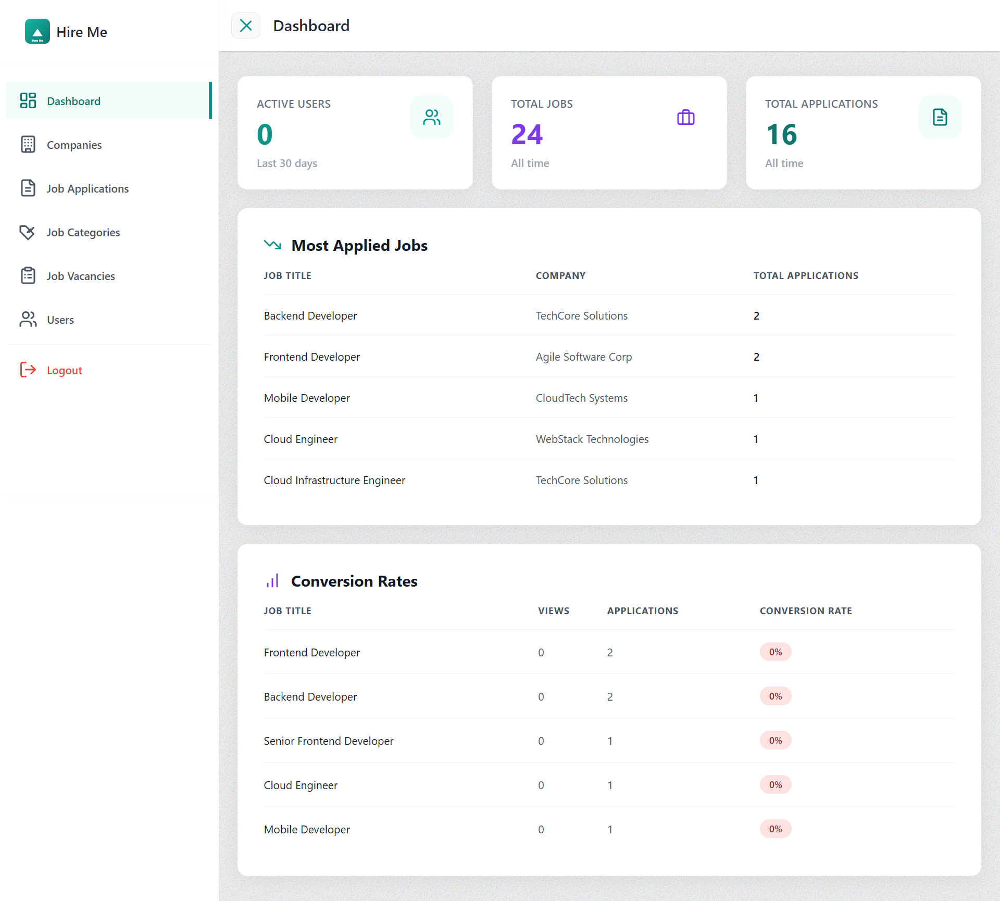

# Job Vacancies Platform — Job Backoffice & Automation Engine

<div align="center">



[](https://laravel.com)
[](https://php.net)
[](https://tailwindcss.com)
[](https://alpinejs.dev)
[](https://mysql.com)
[](https://frankenphp.dev)

</div>

- **Live Production URL**: [admin.hireme-platform.online](https://admin.hireme-platform.online/login)

---

## 📋 Table of Contents

- [Introduction](#-introduction)
- [Key Features](#-key-features)
- [Automated Job Ingestion Pipeline](#-automated-job-ingestion-pipeline)
- [Smart Purge Engine](#-smart-purge-engine)
- [Job Hunter Pipeline & Follow-up Tracking](#-job-hunter-pipeline--follow-up-tracking)
- [Scheduler & Background Automation](#-scheduler--background-automation)
- [Artisan CLI Commands](#-artisan-cli-commands)
- [Project Interfaces](#-project-interfaces)
- [Architecture & Directory Structure](#-architecture--directory-structure)
- [Installation & Local Setup](#-installation--local-setup)
- [Automated CI/CD Deployment](#-automated-cicd-deployment)
- [Technologies Used](#-technologies-used)
- [Security & Contribution](#-security--contribution)

---

## 🚀 Introduction

**Job Backoffice** is the administrative command center and automated data ingestion powerhouse of the **Job Vacancies Platform**. It provides administrators and company owners with full management of vacancies, applications, and companies, while operating an **Autonomous Ingestion Pipeline** that aggregates, sanitizes, embeds, and schedules external vacancies from premier global and Gulf tech companies.

---

## ✨ Key Features

### 👑 1. Master System Administration
- **Complete Ecosystem Control**: Supervise all users, companies, listings, and applications.
- **Role-Based Access Control (RBAC)**: Distinct permissions for Super Admins and Company Owners.
- **Company Verification**: Review and approve newly registered employers and organizations.
- **Soft Deletes & Recovery**: Protection against accidental data loss with full restore capabilities.

### 🤖 2. Automated Job Ingestion Pipeline
- **Multi-Source Job Harvesting**: Pluggable adapter architecture extracting vacancies via APIs and RSS.
- **Greenhouse Board Ingestion**: Direct integration with Greenhouse job boards of 20+ top tech companies (GitLab, Notion, Figma, Canonical, Tamara, Jahez, Floward, STC, Careem, etc.).
- **WeWorkRemotely RSS Ingestion**: Aggregates top-tier international remote opportunities.
- **HTML Sanitization (`htmlToPlainText`)**: Intelligent sanitization removing messy HTML tags and escaped entities while preserving bullet points and paragraph breaks.
- **Automated Vector Embedding**: Integrates with OpenAI (`text-embedding-3-small`) to generate 1536-dimensional embeddings for all new and updated vacancies.
- **Idempotency & De-duplication**: Prevents duplicate records using unique `source_url` indexes.

### 🎯 3. Job Hunter Pipeline & Follow-up Tracker
- **Dual Application Tracking**: Segregates public candidate submissions from personal job hunter applications.
- **Hunter Lifecycle Stages**: Track personal applications across `Draft`, `Applied`, `Interviewing`, `Offered`, `Rejected`, and `Withdrawn`.
- **Channel & Contact Logging**: Record applied channels (LinkedIn, Company Website, Referral) and contact personnel.
- **Interview Logs & Follow-up Dates**: Chronological notes trail for tracking screening calls, technical rounds, and next follow-up dates.

### 🧹 4. Smart Purge Engine
- **Unmatched Role Cleanup**: Removes non-technical positions (Sales, Marketing, HR, Finance) and fundamental stack mismatches (e.g. C++ embedded/firmware roles) using `JobFilter` and `SkillMatcher`.

---

## ⏰ Scheduler & Background Automation

The platform features an autonomous scheduling service running daily background routines without blocking user requests:

```
[02:00 Daily] ──► jobs:import-external --source=greenhouse --limit=50 (without overlapping)
[02:30 Daily] ──► jobs:import-external --source=weworkremotely --limit=20 (without overlapping)
```

Configured in `routes/console.php` with automated output logging to `storage/logs/scheduler-*.log`.

---

## 💻 Artisan CLI Commands

Run and test backoffice operations from the terminal:

```bash
# 1. Import external vacancies from all configured sources
php artisan jobs:import-external

# 2. Import from a specific source with a safety limit
php artisan jobs:import-external --source=greenhouse --limit=15
php artisan jobs:import-external --source=weworkremotely --limit=10

# 3. Purge non-technical and stack-incompatible vacancies
php artisan jobs:purge-unmatched

# 4. View scheduled background jobs
php artisan schedule:list

# 5. Run database migrations safely
php artisan migrate --force
```

---

## 🖼 Project Interfaces

| Interface | Purpose |
| :--- | :--- |
| **Admin Login** | Secure entry point with credential protection |
| **Command Dashboard** | Real-time analytics, user statistics, and recent activity logs |
| **Job Vacancies Directory** | Manage, filter, and inspect internal and imported vacancies |
| **Job Applications Manager** | Track incoming applicant submissions and hunter applications |
| **Hunter Pipeline View** | Dedicated stage-based tracking, interview logs, and follow-up alerts |
| **Company Verification** | Review and verify employer registrations and profiles |

---

## 📂 Architecture & Directory Structure

```
job-backoffice/
├── app/
│   ├── Console/Commands/
│   │   ├── ImportExternalJobs.php   # jobs:import-external command
│   │   └── PurgeUnmatchedJobs.php   # jobs:purge-unmatched cleanup command
│   ├── Http/Controllers/
│   │   ├── DashboardController.php  # Analytics and statistics
│   │   ├── JobApplicationController.php # Applications and Hunter pipeline management
│   │   └── JobVacancyController.php # Job listings management
│   ├── Models/                      # Eloquent models (extended from job-shared)
│   └── Services/
│       └── JobImport/
│           ├── JobSourceAdapter.php       # Adapter contract interface
│           ├── GreenhouseAdapter.php      # Greenhouse API adapter & HTML cleaner
│           ├── WeWorkRemotelyAdapter.php  # RSS feed adapter
│           └── JobImportService.php       # Ingestion orchestrator & deduplication engine
├── config/
│   ├── job_sources.php              # Greenhouse boards and RSS configurations
│   └── openai.php                   # OpenAI API connection settings
├── database/
│   ├── migrations/                  # Database schema definitions & Hunter mode migrations
│   └── seeders/                     # Initial database seeding
├── resources/views/                 # Blade administrative templates
├── routes/
│   ├── web.php                      # Administrative web routes
│   └── console.php                  # Scheduled import jobs definitions
├── .github/workflows/
│   └── deploy.yml                   # Smart zero-downtime deployment workflow
└── Dockerfile                       # Multi-stage production container with FrankenPHP
```

---

## ⚙️ Installation & Local Setup

### 1. Clone the Repository
```bash
git clone https://github.com/Ammar-1993/job-backoffice.git
cd job-backoffice
```

### 2. Install Dependencies
```bash
composer install
npm install
```

### 3. Configure Environment
```bash
cp .env.example .env
nano .env
```
Ensure your database and OpenAI settings are configured:
```env
DB_CONNECTION=mysql
DB_HOST=127.0.0.1
DB_PORT=3306
DB_DATABASE=jobs_db
DB_USERNAME=root
DB_PASSWORD=your_password

OPENAI_API_KEY=sk-proj-...
JOB_IMPORTER_SYSTEM_EMAIL=importer@hireme-platform.online
```

### 4. Database Setup & Assets Build
```bash
php artisan key:generate
php artisan migrate --seed
npm run build
```

### 5. Launch the Server
```bash
php artisan serve
```
Visit `http://localhost:8000` (or `http://localhost:8081` if running via Docker).

---

## 🚀 Automated CI/CD Deployment

The repository uses a smart GitHub Actions workflow ([`deploy.yml`](.github/workflows/deploy.yml)):

- **Pre-syncs `job-shared`** on every deployment.
- **Change Impact Detection (`git diff`)**: Code changes deploy instantly via in-place hot sync (< 3 seconds) without rebuilding Docker containers.
- **Database Migrations**: Automatically runs `php artisan migrate --force`.
- **Cache Optimization**: Runs `optimize:clear` and `optimize` to refresh framework bootstrapper.

---

## 🔐 Default Credentials (Development / Demo)

- **Role**: Super Admin
- **Email**: `admin@admin.com`
- **Password**: `12345678`

---

## 👤 Author

<div align="center">
  <p>Architected & Engineered with ❤️ by <b>Eng. Ammar Al-Najjar (م. عمار النجار)</b></p>

<p>
  <a href="mailto:ammaralnggar@gmail.com">
    
  </a>
  <a href="https://wa.me/967714294340">
    
  </a>
  <a href="https://ammar1993.vercel.app/">
    
  </a>
  </p>
  <div align="center">
   <sub>All rights reserved © 2026 Engineer Ammar Al-Najjar</sub>
  </div>
</div>
